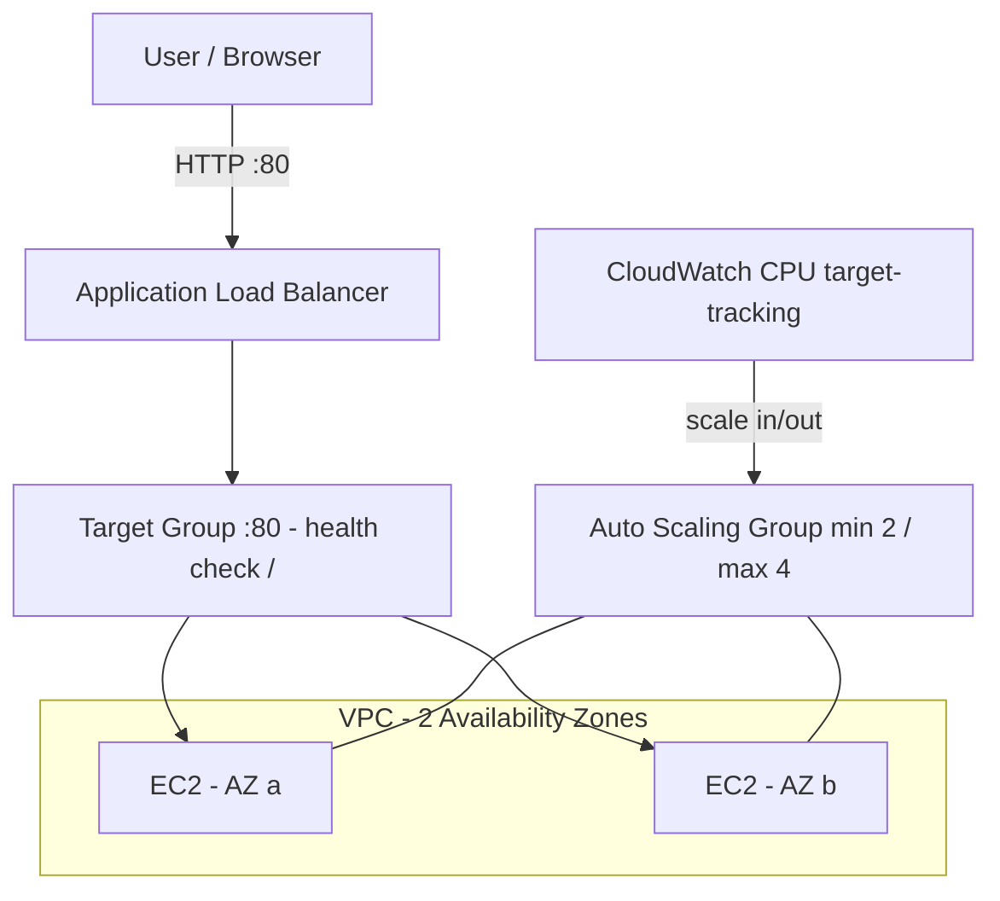

# Architecture — Highly Available Web App (EC2, ALB & Auto Scaling)

This diagram shows the highly available, self-healing web tier deployed on AWS.

## How it works

- The Application Load Balancer receives internet traffic on port 80 and distributes it across healthy EC2 targets.
- The Auto Scaling Group runs 2 to 4 instances across two Availability Zones for fault tolerance.
- CloudWatch target-tracking scaling adds or removes instances based on average CPU.
- If an instance or an entire AZ fails, the ALB routes traffic only to healthy instances in the other zone.
