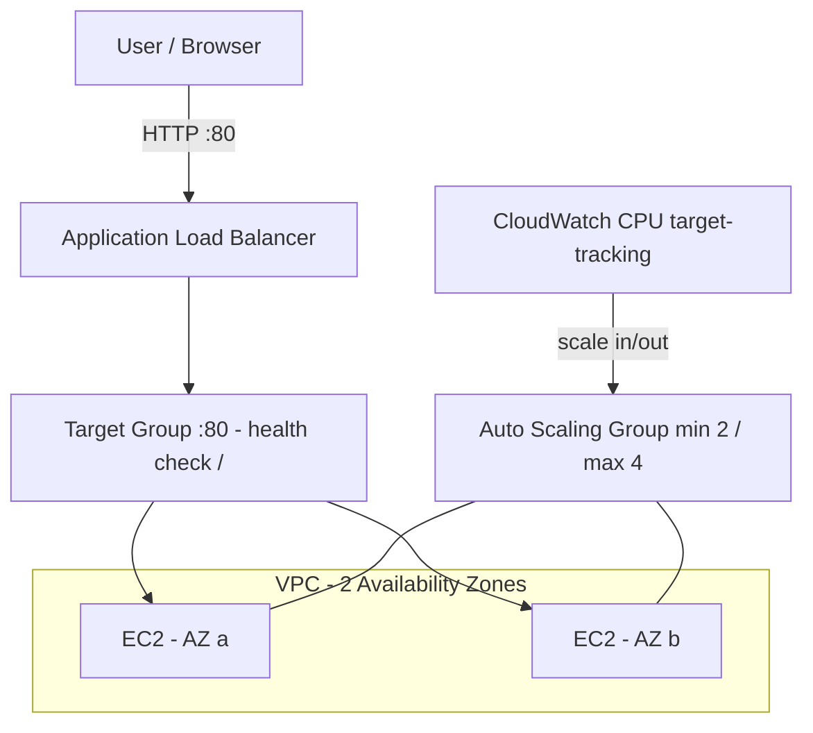

# Highly Available Web Application (EC2, ALB & Auto Scaling)

This project deploys a highly available and fault-tolerant web application on AWS using EC2 instances behind an Application Load Balancer (ALB), with an Auto Scaling Group (ASG) spread across multiple Availability Zones and CloudWatch-based scaling.

## Architecture



> Full diagram details: [ARCHITECTURE.md](ARCHITECTURE.md)

## Skills Covered

- EC2 instance provisioning with user data bootstrap
- Application Load Balancer (ALB) and target groups
- Auto Scaling Group across multiple Availability Zones
- Target-tracking scaling policy with CloudWatch
- Security Groups for ALB and instances
- High availability and fault tolerance design
- Infrastructure as Code with CloudFormation

## How It Works

The ALB distributes incoming traffic across EC2 instances launched by the Auto Scaling Group in two or more Availability Zones. CloudWatch monitors CPU utilization and a target-tracking policy scales the fleet in or out automatically. If an instance or an entire AZ fails, the ALB routes traffic to healthy instances in other zones.

## Project Structure

```
cloudformation/ha-web-app.yaml   CloudFormation template (ALB, ASG, Security Groups, scaling policy)
scripts/user-data.sh             EC2 bootstrap script that installs and starts the web server
```

## Deployment Flow

1. Choose a VPC and two or more public subnets in different Availability Zones.
2. Deploy the CloudFormation stack with those parameters.
3. CloudFormation creates the ALB, target group, launch template, Auto Scaling Group and scaling policy.
4. Instances bootstrap using scripts/user-data.sh and register with the target group.
5. Access the application through the ALB DNS name from the stack outputs.

## Commands

```bash
aws cloudformation deploy \
  --template-file cloudformation/ha-web-app.yaml \
  --stack-name ha-web-app \
  --parameter-overrides VpcId=vpc-xxxx SubnetIds=subnet-aaaa,subnet-bbbb \
  --capabilities CAPABILITY_IAM
```

## Cleanup

```bash
aws cloudformation delete-stack --stack-name ha-web-app
```

## Notes

Replace the sample VPC ID, subnet IDs and other parameter values with your own before deploying in a real AWS account.
